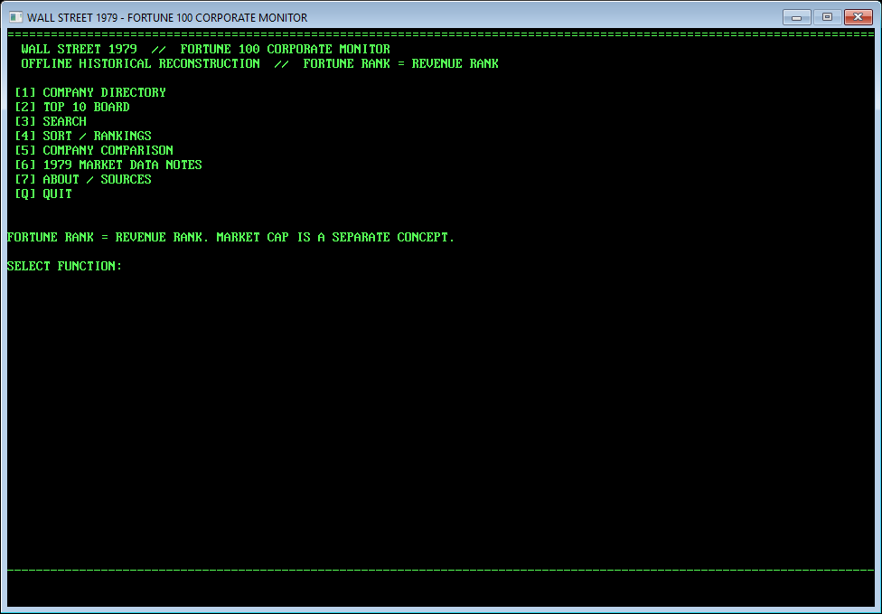
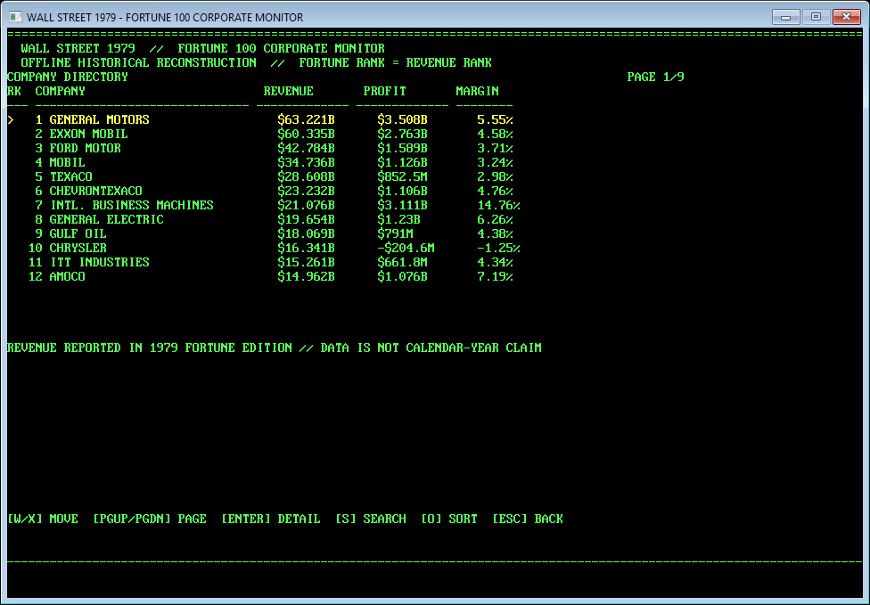
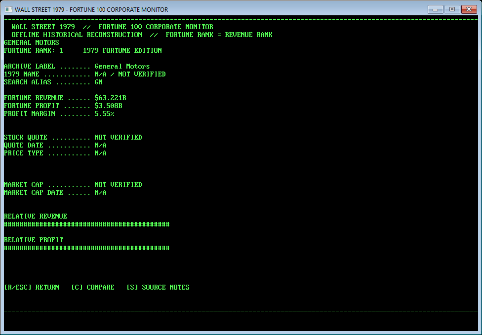

# Wall Street 1979 — Fortune 100 Corporate Monitor in BASIC

WALLST79.BAS is a deliberately old-fashioned, line-numbered BASIC application that turns the first 100 companies in the 1979 Fortune 500 edition into an offline corporate monitor for Windows.

The project is a small programming-archeology experiment: a 1979-style data terminal, with DATA, READ, arrays, GOSUB, GOTO and primitive sorting, compiled in 2026 into a standalone Windows x64 executable.

## 100% BASIC

All first-party application logic is in WALLST79.BAS. The repository is configured for GitHub Linguist so the intended language result is BASIC 100.0%. QB64-PE is only an external build tool; generated C/C++ files and compiler internals are not part of the repository.

## Features

- all 100 canonical Fortune records from the supplied 1979 dataset;
- fully offline runtime with embedded BASIC DATA statements;
- keyboard-first retro terminal interface;
- paginated company directory;
- case-insensitive substring search, including small aliases such as IBM;
- Fortune-rank, revenue, profit, profit-margin and alphabetical sorting;
- top-10 revenue/profit/margin boards;
- verified-price and verified-market-cap views that clearly report zero coverage;
- full company detail pages with revenue, profit, margin and generated ASCII bars;
- side-by-side company comparison with differences and revenue ratio;
- explicit N/A / NOT VERIFIED handling for unavailable data.

## Historical data policy

This application uses the ranks 1–100 of the 1979 Fortune 500 edition, ranked by revenue. Fortune rank is not market-cap rank.

The displayed revenue and profit values are the values in the canonical project specification. The edition/publication year is not presented as a casual calendar-year financial claim. Archive labels are preserved even when the archive uses a later successor or acquiring identity.

No stock price or market capitalization is fabricated. Version 1 ships with:

- historical stock prices verified: 0 / 100;
- historical market caps verified: 0 / 100;
- every unavailable price and market-cap field displayed as N/A or NOT VERIFIED.

That incomplete coverage is intentional: an uncertain historical quote is worse than an honest blank.

## Run

Download WALLST79-Windows-x64.exe from the latest GitHub Release and double-click it. The release executable is self-contained and does not require QB64-PE, Python, .NET, source files or an internet connection.

The source-tree executable is ignored by Git. Local development builds are written to build/.

## Build from source

Install QB64 Phoenix Edition outside this repository, then run from the QB64-PE directory:

    qb64pe -x D:\Basic\WALLST79.BAS -o D:\Basic\build\WALLST79-Windows-x64.exe

The checked-in application source remains BASIC; the compiler may generate internal C/C++ artifacts while building, but those artifacts are not tracked.

## Sources

- CNN/Fortune 500 archive: https://money.cnn.com/magazines/fortune/fortune500_archive/
- Parsed historical Fortune 500 dataset: https://github.com/cmusam/fortune500
- 1979 CSV mirror: https://raw.githubusercontent.com/cmusam/fortune500/refs/heads/master/csv/fortune500-1979.csv
- Fortune archive naming caveat: https://money.cnn.com/magazines/fortune/fortune500_archive/snapshots/1979/22.html
- QB64 Phoenix Edition: https://github.com/QB64-Phoenix-Edition/QB64pe
- GitHub Linguist language definitions: https://github.com/github-linguist/linguist/blob/main/lib/linguist/languages.yml
- GitHub Linguist overrides: https://github.com/github-linguist/linguist/blob/main/docs/overrides.md

The Fortune list is a revenue ranking. A market-cap observation is not substituted for a complete historical market-cap dataset.

## License

MIT. See LICENSE.
