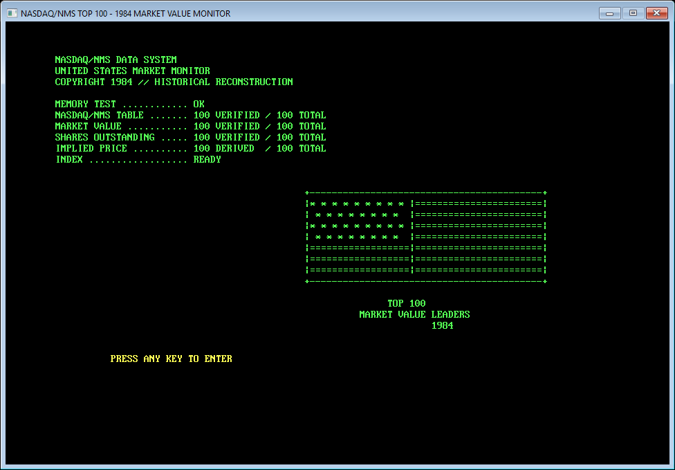
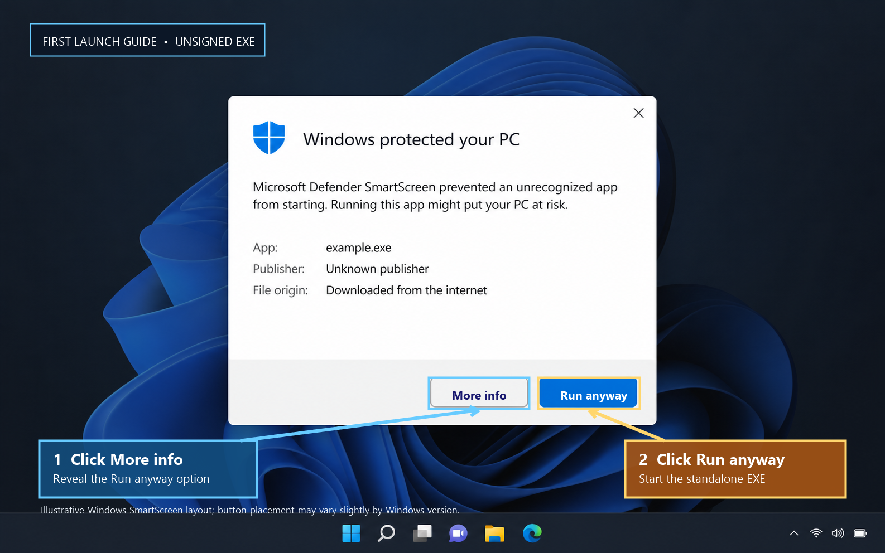

# NASDAQ/NMS TOP 100 — 1984 Market Value Monitor

NASDAQ/NMS TOP 100 is a deliberately old-fashioned, line-numbered BASIC application built around the historical 1984 table of 100 NASDAQ/NMS market-value leaders.

It is a compact financial terminal from an alternate 1980s: black screen, phosphor green text, amber selection, ASCII U.S. flag, keyboard navigation and a standalone Windows x64 executable.

## Download / first launch on Windows

Download `NASDAQ-NMS-1984-Windows-x64.exe` from the [official GitHub Release](https://github.com/Cresscendoll/wall-street-1979-basic/releases/latest).

The release is a standalone Windows x64 executable. No BASIC compiler, QB64-PE installation, Python runtime, source checkout or internet connection is required to run it.

## First launch on Windows / SmartScreen notice

Windows Defender SmartScreen may show a standard warning the first time you launch the EXE. This happens because the executable is not digitally signed / code-signed, so Windows has not built a publisher reputation for it yet. That is common for small independently distributed software releases.

This warning is about code-signing reputation, not about the application being packaged incorrectly. The program remains a standalone EXE; a BASIC compiler is not required.

To continue:

1. Click **More info**.
2. Click **Run anyway**.

For safety, download the file only from this repository's official GitHub Release. If desired, verify the published SHA-256 checksum:

    E88A7EA6E12265A58EBEB690F3B22E03167DEDBAACD402983B42B7682B1BEFFB

## 100% BASIC

All first-party application logic is in WALLST79.BAS. The repository is configured for GitHub Linguist so the intended language result is BASIC 100.0%.

QB64 Phoenix Edition is only the external build machine. Generated C/C++ files, compiler internals and helper programs are not tracked.

## Dataset

The runtime contains exactly 100 historical rows from the canonical NASDAQ/NMS 1984 dataset:

- source rank by market value;
- source market value: 100/100 verified;
- source shares outstanding: 100/100 verified;
- implied dollar-per-share: 100/100 derived;
- share of the Top-100 market-value pool: 100/100 derived.

The source rows are embedded directly as BASIC DATA statements. Key sentinels are Intel Corporation at rank 1, MCI Communications Corporation at rank 2, Apple Computer, Inc. at rank 3, Betz Laboratories, Inc. at rank 50, Network Systems Corporation at rank 51 and Ogilvy & Mather International Inc. at rank 100.

The transcribed source aggregate is approximately $61.180B across the 100-company pool.

## Historical honesty

This is not the official NASDAQ-100 Index roster. The source table is labeled 100 NASDAQ/NMS MARKET VALUE LEADERS — 1984.

The archival source does not specify an exact trading-day snapshot. The application therefore uses SOURCE YEAR: 1984 and does not claim a December 31 close or another invented date.

Market value and shares outstanding are source fields. IMPLIED $/SHARE is calculated as:

    market value / shares outstanding

The derived figure is never presented as an independently verified historical closing quote. Historical company names are preserved as transcribed; they are not modernized to successor corporations.

## Features

- offline runtime with no API, account, login, telemetry or update checker;
- 100/100 market-value and shares coverage;
- boot screen with honest verified/derived counters;
- compact ASCII U.S. flag and 1984 terminal identity;
- paginated market-value directory;
- case-insensitive company search;
- source-rank, market-value, shares, implied-price, alphabetical and pool-weight sorting;
- Top-10 boards for market value, shares, implied price and pool weight;
- company detail screen with derived-price warning and generated bar chart;
- market overview with total, average, median, Top-10 aggregate, pool share and ASCII chart;
- side-by-side comparison with differences and market-value ratio;
- keyboard-first navigation.

## Build from source

Install [QB64 Phoenix Edition](https://github.com/QB64-Phoenix-Edition/QB64pe) outside this repository and run:

    qb64pe -x D:\Basic\WALLST79.BAS -o D:\Basic\build\WALLST79-Windows-x64.exe

The source remains BASIC; compiler-generated intermediates stay outside the tracked tree.

## Provenance

The canonical transcribed dataset and migration methodology are included in [NASDAQ_NMS_1984_VERIFIED_DATASET.md](NASDAQ_NMS_1984_VERIFIED_DATASET.md).

Primary archival source:

- Montana State Senate, Business & Industry Committee minutes, February 14, 1985:
  https://courts.mt.gov/external/leg/1985/senate/02-14-sbus.pdf

The table appears in the archival exhibits under 100 NASDAQ/NMS MARKET VALUE LEADERS — 1984.

Supporting historical context:

- NASDAQ-100 history and launch context:
  https://www.nasdaq.com/newsroom/what-is-the-nasdaq-100-guide-to-one-of-worlds-most-watched-indexes

## Repository

The prepared public repository is:

https://github.com/Cresscendoll/wall-street-1979-basic

GitHub Linguist configuration explicitly classifies WALLST79.BAS as BASIC and documentation as documentation. The Windows executable belongs in GitHub Releases rather than the source tree.

## License

MIT. See LICENSE.
